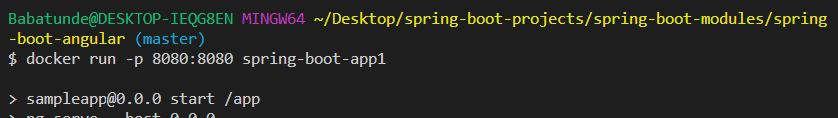

# How to Dockerize Angular and Spring Boot Application

The following Prequisites are required and installed
* Java JDK 16.0.1
* Node 14.7.*
* Angular CLI 1.7.4
* Python v3.10.* (added to path)

Checking the installed versions:

```bash
C:\Users\Babatunde>java --version
java 16.0.2 2021-07-20
Java(TM) SE Runtime Environment (build 16.0.2+7-67)
Java HotSpot(TM) 64-Bit Server VM (build 16.0.2+7-67, mixed mode, sharing)
```

```bash
C:\Users\Babatunde>ng version

    _                      _                 ____ _     ___
   / \   _ __   __ _ _   _| | __ _ _ __     / ___| |   |_ _|
  / △ \ | '_ \ / _` | | | | |/ _` | '__|   | |   | |    | |
 / ___ \| | | | (_| | |_| | | (_| | |      | |___| |___ | |
/_/   \_\_| |_|\__, |\__,_|_|\__,_|_|       \____|_____|___|
               |___/

Angular CLI: 1.7.4
Node: 14.7.0
OS: win32 x64
Angular:
...
```

maven version

```bash
C:\Users\Babatunde>mvn --version
Apache Maven 3.8.1 (05c21c65bdfed0f71a2f2ada8b84da59348c4c5d)
Maven home: C:\ProgramData\chocolatey\lib\maven\apache-maven-3.8.1\bin\..
Java version: 1.8.0_291, vendor: Oracle Corporation, runtime: C:\Program Files\Java\jdk1.8.0_291\jre
Default locale: en_US, platform encoding: Cp1252
OS name: "windows 10", version: "10.0", arch: "amd64", family: "windows"
```

Python Version
```bash
C:\Users\Babatunde>python --version
Python 3.9.6
```

## Angular Spring Boot Application Before Dockerizing

I cloned the entire repository and change directory to application where the frontend angular project and backend spring boot task are.

- change directory for frontend
```bash
cd spring-boot-modules/spring-boot-angular/src/main/js/application/
```
- change directory for backend
```bash
cd spring-boot-modules/spring-boot-angular
```

```bash
git clone https://github.com/aizedevops/spring-boot-projects.git
```

Next I made sure the version of Node I am using is 14.7.0 and the angular cli version is 1.7.4. 

I then installed the dependecies in the package.json file using:

```bash
npm install
```

Next I ran `ng serve` to launch the frontend application

I then installed maven dependencies

```bash
mvn clean install
```
Next, I ran mvn spring-boot to start the spring-boot backend
```bash
run: mvn spring-boot:run
```

I then accessed the app on `localhost:4200`


## Dockerizing Angular Spring Boot Application

### Step 1
I created a docker file in this directory location `spring-boot-projects\spring-boot-modules\spring-boot-angular\src\main\js\application`

change directory to `spring-boot-projects\spring-boot-modules\spring-boot-angular\src\main\js\application`
 and create `Dockerfile`
```bash
touch Docker
```

I then create a script to build the docker image for the frontend angular application in below directory

`spring-boot-projects\spring-boot-modules\spring-boot-angular\src\main\js\application`


### script for frontend docker angular image
```javascript
#Build Stage
FROM node:14.7.0-alpine3.12 AS build
RUN mkdir -p /app
WORKDIR /app
COPY package*.json /app/
RUN npm install
RUN npm install -g @angular/cli@1.7.4
COPY ./ /app/
RUN npm build --prod
CMD [ "npm", "start" ]
```
I ran script below to create the frontend image and named it `angular-app` in the current directory
```bash
docker build -t angular-app .
```

I ran docker images to list the images

```bash
docker images
```

output 
```bash
REPOSITORY                                 TAG       IMAGE ID       CREATED         SIZE
angular-app                                latest    6cbe74900cef   2 minutes ago   875MB
ghcr.io/conradludgate/spotify-auth-proxy   latest    1a52fb79bae0   9 months ago    12.9MB
```
I ran below script to create and start the container for the angular frontend docker image and opened port 4200 on the host pc which is my laptopp and port 4200 on container.

```bash
$ docker run -p 4200:4200 --name angular-container angular-app
```
-p is port to run on where 4200 is the port on the host and the other 4200 is the port on the container.
--name angular-container is the name I give the angular container. While angular-app is the angular frontend image.

The angular container ran successfully


I opend the browser on port localhost:4200 and the frontend is displayed.


### Step 2

I created a docker file in this directory location.`spring-boot-projects\spring-boot-modules\spring-boot-angular`

change directory to `spring-boot-projects\spring-boot-modules\spring-boot-angular`
 and create `Dockerfile`
```bash
touch Docker
```


### script for backend docker spring-boot image

```javascript
#Build Stage
FROM maven:3.6-openjdk-8-slim AS build
RUN mkdir -p /spring-boot-project 
COPY . /spring-boot-project

WORKDIR /spring-boot-project/spring-boot-modules/spring-boot-angular
RUN cd  /spring-boot-project/spring-boot-modules/spring-boot-angular
RUN mvn clean package

# Run Stage
FROM openjdk:8-jre-alpine
COPY --from=build /spring-boot-project/spring-boot-modules/spring-boot-angular/target/spring-boot-angular-1.0.jar /app/app.jar
ENTRYPOINT ["java", "-jar", "/app/app.jar"]
```

Next, I ran script below to create the frontend image and named it `angular-app` in the current directory

```bash
 docker build -t spring-boot-app1 .
 ```
 I ran docker images to list the images

```bash
docker images
```
output 


I then ran the spring-boot container and is running



I did `docker ps` to show all running containers


I successfully created both fronend and backend docker images and running containers.